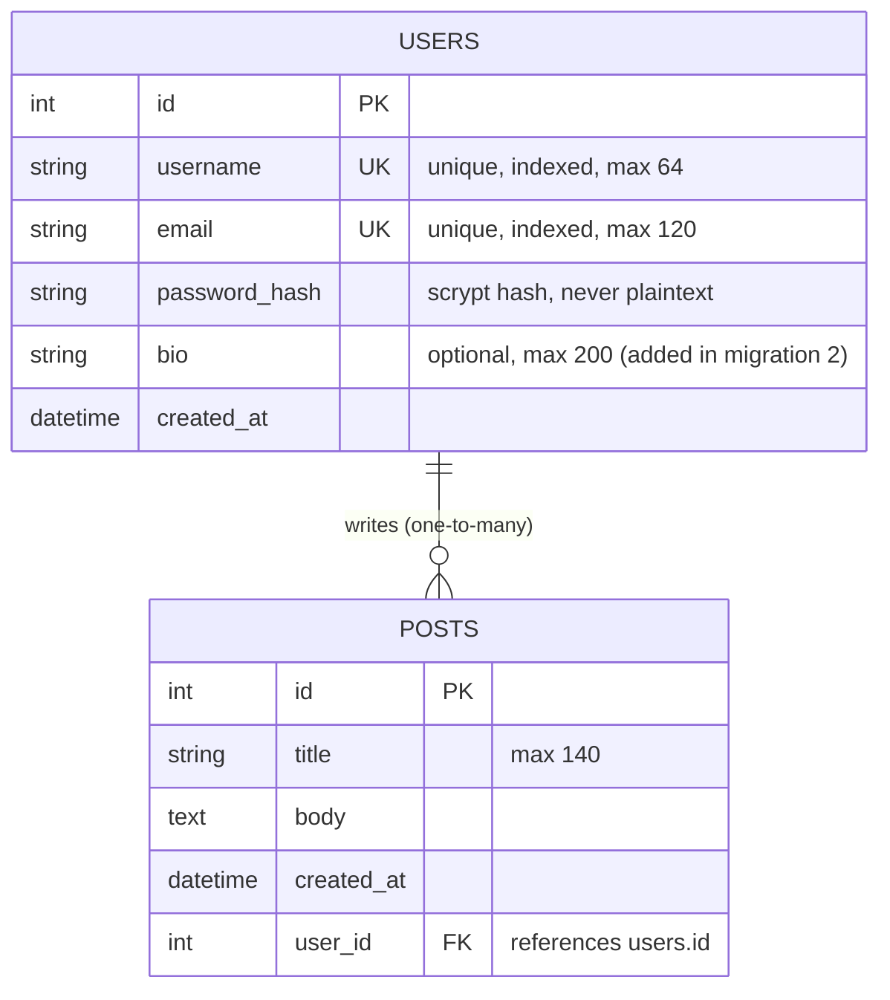

# WTF Forms

Flask learning project: Flask-WTF forms + SQLAlchemy models, built with the app
factory pattern, blueprints, and pipenv-pinned dependencies.

## Stack

| Piece | Version |
|---|---|
| Flask | 3.1.1 |
| Flask-WTF | 1.2.2 |
| Flask-SQLAlchemy | 3.1.1 |
| Flask-Migrate | 4.1.0 |
| Python | 3.12 |

## Database diagram



The relationship is declared on both sides with `back_populates`:
`user.posts` gives a user's posts, `post.author` gives the post's user.

## Migrations

| # | Revision | What it did |
|---|---|---|
| 1 | `a27aabb35f9d` | create `users` and `posts` tables |
| 2 | `7d77ce6958b5` | add `bio` column to `users` |

## Running it

```bash
pipenv install
pipenv run flask db upgrade        # build the schema (FLASK_APP=run.py)
pipenv run python seed.py          # insert demo data — ORM only, no SQL
pipenv run flask run               # http://127.0.0.1:5000
```

- `/register` — Flask-WTF registration form; saves real users (hashed passwords, duplicate checks)
- `/community` — users and their posts rendered from the database
